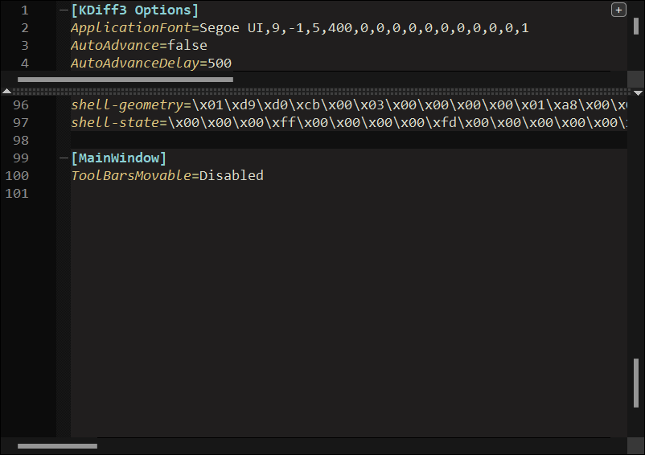

### [KDiff3](https://download.kde.org/stable/kdiff3/?C=M;O=D)

#### Install using Git

If you are a git user, you can install the theme and keep up to date by cloning the repo:

    git clone https://github.com/dracula/kdiff3.git

#### Install manually

Download using the [GitHub .zip download](https://github.com/dracula/kdiff3/archive/master.zip) option and unzip them.

#### Activating theme (for KDiff3 version 1.x and above)

1. Locate KDiff3's config file, `kdiff3rc` (no dot prefix)
   - Linux: `~/.config` folder
   - Windows: `%LOCALAPPDATA%` folder
2. Copy the contents of dracula's `.kdiff3rc` file, insert them into the config file at the end of the `[KDiff3 Options]` section, and save.
   
   

4. Restart KDiff3. Enjoy!

#### Activating theme (for older versions, e.g. 0.9.98)
1. Replace color lines from your `~/.kdiff3rc` (ex on win: `C:\Users\<name>\.kdiff3rc`)  file with the ones from dracula theme's `.kdiff3rc`
2. Restart Kdiff3
3. Boom! It's working
