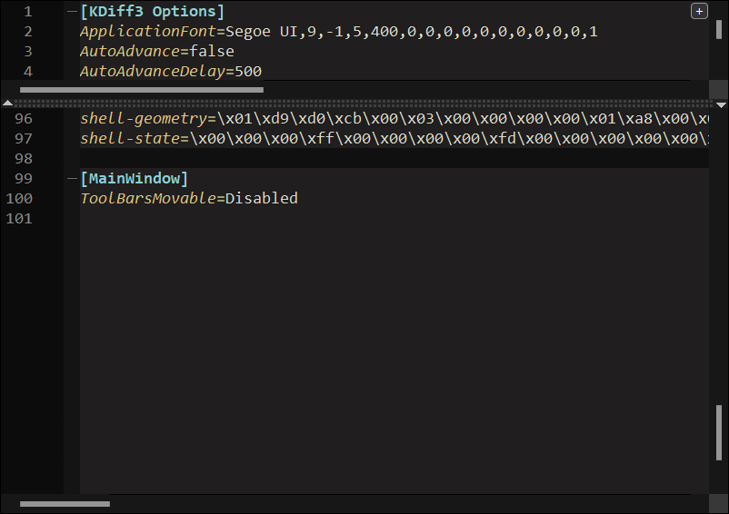

# Dracula for KDiff3

A dark theme for [KDiff3](https://invent.kde.org/sdk/kdiff3) [(Downloads)](https://download.kde.org/stable/kdiff3/).

## Install Theme

### KDiff3 version 1.x and later

Append contents of theme file [`kdiff3rc`](kdiff3rc) into configuration file at the end of the `[KDiff3 Options]` section, and save.

| OS      | Configuration file path          |
| ------- | -------------------------------- |
| Windows | `%LOCALAPPDATA%\kdiff3rc`        |
| macOS   | `~/Library/Preferences/kdiff3rc` |
| Linux   | `~/.config/kdiff3rc`             |

Restart KDiff3 to effect changes.

### Older KDiff3 versions (0.9.98 and earlier)

For older versions of KDiff3, installation instructions can be found at [draculatheme.com/kdiff3](https://draculatheme.com/kdiff3).

## Team

This theme is maintained by a bunch of [awesome contributors](https://github.com/dracula/kdiff3/graphs/contributors).

## Community

-   [Twitter](https://twitter.com/draculatheme) - Best for getting updates about themes and new stuff.
-   [GitHub](https://github.com/dracula/dracula-theme/discussions) - Best for asking questions and discussing issues.
-   [Discord](https://draculatheme.com/discord-invite) - Best for hanging out with the community.

## License

[MIT License](./LICENSE)
